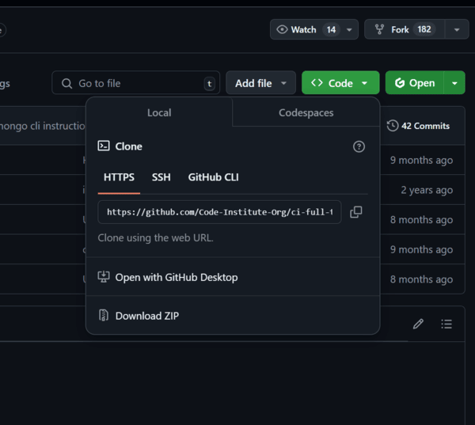

<!--
For creating logo -https://new.express.adobe.com/
https://coolors.co/29339b-74a4bc-b6d6cc-f1fec6-ff3a20 -for creating color pallete.
(https://www.w3schools.com/css/css3_gradients.asp) - for CSS/ HTML
https://pixabay.com/ - picture of papirus.
https://imageresizer.com/
https://www.youtube.com/watch?v=MiTJnYHX3iA -tutorial for typewritter effect
https://www.youtube.com/watch?v=r_PL0K2fGkY - pop up tutorial
https://expertbeacon.com/how-to-read-a-json-file-in-javascript-reading-json-in-js/ - how to manage json files
https://pixabay.com/sound-effects/ -for the sounds
https://alessiopuppialchemy.com/2025/04/01/how-to-allow-only-numbers-or-letters-in-input-fields/ - for inputs
character image -using chat gpt
other illustration for the story https://www.midjourney.com/imagine


Bugs: 
After adding restart button amd mainPage function - pictures from meetCharacters dissapeared.
Now dissapeared the modal for the pictures?
Syntax bugs
After adding showChapter4 and 6 to game steps, in the game after pressing button on the chapter 1, 4 ,5 is was not going in chapter order(randomly) - added if statement to the gameSteps function.
main page function was not working (empty page) -added to the fetch function.
When added restart button - all of the modals dissapeared (just changed frpm $(.class)click(function) to $(document).on(click, class, function))
After adding typing effect - the text was jumping, fixed main contyainer style to display flex, justify flex-start
-->

# **Jungle's Story**


[View live project here!]()


Jungle's Story is an interactive story game created using HTML, CSS, and JavaScript. The story follows Aurora, a brave explorer, her dog Dog, and her best friend Rick, as they venture through the mysterious Jungle of Whispers. Players make choices that influence the story, solve puzzle to unlock the jungle's secrets.

## Content:
- [User Goals](#user-goals)  
- [Business Goals](#business-goals)  
- [Developer Goals](#developer-goals)  
- [User Stories](#user-stories)  
- [Design Choices](#design-choices)  
- [Features](#features)  
- [UX Design](#ux-design)  
- [Technologies Used](#technologies-used)  
- [Testing](#testing)  
- [Bugs](#bugs) 
- [Technical Issues](#technical-issue-with-commit-attribution)
- [Deployment](#deployment)  
- [Publishing](#publishing)  
- [Credits](#credits)  


## User Goals
The website is designed to create an interactive story for users passionate about adventures.

#### Users should be able to:
- Navigate through the story by making choices that influence the plot.
- Interact with characters and objects to uncover clues and treasures.
- Enjoy an immersive experience with sounds, animations, and background effects.
- Go back to the Manual from any point of the story.

## Business Goals
Although primarily an educational and portfolio project, it aims to:
- Showcase interactive storytelling capabilities using JavaScript.
- Demonstrate user engagement through sound and visual effects.
- Highlight technical skills in front-end development and UI/UX design.

## Developer Goals
- Build a fully responsive interactive story using HTML, CSS, and JavaScript.
- Implement smooth animations and sound effects triggered by story events.
- Manage game state and content efficiently using JSON files.
- Use modular code for easy updates and feature additions.

## User Stories
- As a player, I want to enter my name to personalize the story.
- As a player, I want to read the story with a typewriter text effect for better immersion.
- As a player, I want to interact with character images to learn more about them or navigate chapters.
- As a player, I want to make choices that affect the story outcome.
- As a player, I want ambient jungle sounds and effects that match story events.
- As a player, I want to see visual feedback like glowing highlights on interactive elements.

 ## Design Choices
 
 Wireframes:

(documentation/jungle_wireframes.png)

## Features

### Navigation
- Navbar present on all pages featuring the game logo.
- Navbar includes a "Back to Manual" button for easy navigation to instructions.

### Manual Page
- Explains the goal of the game, how to make choices, and what to expect.
- Brief instructions on sound effects, puzzle, and replay options.
- Contains Username input, that is used in the last chapter.

### Interactive Introduction
- Character images that lead to the beginning of the story.
- Hover effects and sound cues for each character.

### Game Chapters
- CBackground music accompanies chapters to create an immersive mood, with controls to toggle sound.
- Overall story adapts responsively to player decisions, creating a personalized experience.
#### Story Container
- Displays the narrative text using a typewriter effect for immersive reading.
- Dynamically updates to reflect player choices and story progression.
#### Choices Container
- Contains buttons for branching story decisions or continue button.
- Each choice influences the narrative path and unlocks new content.
#### Pictures Container
- Shows images that visually depict story scenes and characters.
- Supports animations and visual effects to enhance atmosphere.

### Mini-Game
- Puzzle Game: Match the correct key to SUN, MOON, and STAR symbols.
- Immediate feedback on correct and incorrect choices.

### Footer
- Displays copyright and author credits.

## UX Design
The design of the game was inspired by old-school adventure games, aiming to recreate their nostalgic style while adapting it to the chosen jungle exploration theme. I focused on blending classic elements with modern touches and added extra effects—like typewriter text, sound cues, and hover animations—to enhance immersion and make the experience feel more vivid and realistic.
### Colors and Theme
- The color palette uses subtle greens and yellows to reflect the jungle environment, creating a warm, natural atmosphere.
- Contrast between text and background is carefully balanced for easy reading, especially during long narrative sections.
### Color Scheme:
- rimary-color: #1C350B; green 
- secondary-color: #a1c08c; brown 
- highlight-color: #F9F9E5; purple
- highlight-color-light: #f3f596; light yellow
    
(documentatio/color-scheme.png)

### Fonts
- Leckerli One (primary font): A friendly, rounded serif font that evokes a handwritten, storybook feel, perfect for narrative text and immersive storytelling.
- Berkshire Swash (secondary font): A decorative, cursive font used for headings and special elements, adding a whimsical and adventurous flair reminiscent of vintage adventure titles.

### Effects and Interactions
- Typewriter Text Effect:
   - This effect reveals text character-by-character, mimicking the experience of reading a live-written letter or journal. It increases immersion and pacing, encouraging players to absorb each part of the story thoughtfully.
- Hover Effects on Characters:
   - Character images respond visually on mouse hover by slightly enlarging or glowing, which guides players intuitively to interactive elements and adds a layer of polish.
- Background Music Controls:
   - Players can toggle background music on or off, ensuring a customizable experience that respects different user preferences or environments.

### Accessibility
- Font sizes and button sizes are optimized for readability and easy interaction on both desktop and mobile devices.
- Color choices maintain sufficient contrast to accommodate users with visual impairments.

### Responsivness
Importantly, the design is fully responsive and adapts smoothly to all screen sizes, ensuring a consistent and enjoyable experience across desktops, tablets, and mobile devices.

## Technologies used

- **HTML** is used to structure the content on the website.

- **CSS** is used to style the website, including layouts, colors, fonts, and overall design.

- **CSS Flexbox** is used for creating responsive layouts by aligning and distributing elements within a container.

- **Bootstrap** is used for quick and responsive design with pre-built components like buttons.

- **JavaScript** — Used to build the game logic, handle user interactions, manage story branching, and implement effects such as typing animation and mini-games.

- **JSON** — Utilized for organizing and storing story content and game data, making it easier to manage and scale the interactive narrative.

- **jQuery** — Employed for DOM manipulation, event handling, and simplifying JavaScript code, especially for animations and UI updates.

- **Git** is used for version control, allowing tracking of code changes and collaboration with team members.

- **GitHub** is used to host the project’s repository and deploy the website through GitHub Pages.

- **Font Awesome** is used to add scalable vector icons to the website for better user interaction.

- **Google Fonts** is used to enhance typography by integrating stylish fonts into the website.

- **Visual Studio Code** is used as the code editor for writing and managing the website's source code.

- **ImageResizer** (https://imageresizer.com/) — Used to optimize and resize images for better performance and faster loading times without losing quality.

- **Midjourney** (https://www.midjourney.com/imagine) — An AI tool used to create unique and thematic game artwork and background visuals.

- **Adobe Express** (https://new.express.adobe.com/) — Used for designing the game logo, combining creativity with easy-to-use graphic tools.

- **Coolors** (https://coolors.co/29339b-74a4bc-b6d6cc-f1fec6-ff3a20) — Helped create the game’s harmonious color palette, balancing cool and warm tones to suit the jungle adventure theme.


## Testing 
### Manual testing results:


#### Lighthouse Report:


### Compatibility


- **Chrome:**  


- **Mozilla Firefox:**


- **Microsoft Edge:**


### Responsiveness

- **Main Page:**


### Validator Testing 

#### HTML 

On sign up page use (fieldset) element inside div with radio-buttons and checkboxes - fixed.
No other errors or warnings were found.

  - **Index.html:** 

  

#### CSS

  - **Style.css:**

  

## Bugs

### Solved bugs


### Unfixed Bugs

- No unfixed bugs found.


## Deployment
[Live project can be found here!](https://alexdotrud.github.io/floristry_school_project/)

The project was deployed using GitHub Pages, which allows for easy hosting of static websites directly from a GitHub repository.
 Below are the steps taken to deploy the website.

 ### Steps to Deploy:

#### 1. Push to GitHub Repository:
First, the project files were committed to a GitHub repository. All HTML, CSS, JavaScript, and image files were uploaded and organized within the repository.
#### 2. GitHub Pages Setup:
Once the repository was set up, the GitHub Pages feature was enabled. This is done through the repository's settings.
In the repository’s settings, navigate to the "Pages" section.
Select the main branch (or the branch containing your index.html file) as the source for GitHub Pages.
Choose the root directory as the source if the index.html file is located in the main directory.
#### 3. Accessing the Live Site:
After enabling GitHub Pages, GitHub generates a URL where the project can be viewed live. This URL is shared and accessible by anyone with the link.
The live project can be accessed here: Live Project URL.
#### 4. Continuous Updates:
Any future changes or updates made to the website can be easily deployed by committing changes to the repository, which automatically updates the live site.

## Publishing
We welcome contributions to floristry_school_project! Follow these steps:

### Cloning
1. On GitHub.com, navigate to the main page of the repository.
2. Above the list of files, click Code.
3. Copy the URL for the repository.

 

4. Type git clone in opened terminal, and then paste the URL you copied earlier.
5. Press Enter to create your local clone.

### Forking
1. Fork the repository.  

2. Create a feature branch:  
   ```bash
   git checkout -b feature-name
   ```

3. Make your changes and commit:  
   ```bash
   git commit -m "Add feature description"
   ```

4. Push the latest changes and open a pull request:
   ```bash
   git push
   ```


## Credits 

### Content 
- #### Text Content: 
All the content provided on this website is fictional and created for demonstration purposes only.
- #### Images:

1. Picture from Home Page are from- (https://pixabay.com/).
2. Pictures from Gallery Page and picture from Sign Up Page are from - (https://www.pexels.com/).
3. Logo was created on - (https://www.designevo.com/logo-maker/).


### Media
1. **Fonts**: The website uses the Delius Swash Caps font, available from Google Fonts.
2. **Icons**: Icons used in the site were sourced from FontAwesome (https://fontawesome.com/).

### Other tools:
1. **Stack Overflow**: Used for troubleshooting and seeking solutions to development challenges (https://stackoverflow.com/).
2. **CodeWithAnbu**: Resource for learning and improving web development techniques (https://codewithanbu.com/).
3. **W3Schools**: Used for reference and tutorials on HTML, CSS, JavaScript, and more (https://www.w3schools.com/).
4. **Chrome DevTools Lighthouse**: Used to test and improve web performance (https://developer.chrome.com/docs/lighthouse/performance/).
5. **ExpertBeacon**: Helped in learning how to optimize Google Fonts loading for better performance (https://expertbeacon.com/the-ultimate-guide-to-preloading-google-fonts-for-optimal-web-performance/).
6. **Schemecolor**: Used to create color scheme (https://www.schemecolor.com/).
7. **Code Institute**: Used for learning web development techniques and improving skills through the full stack developer program (https://www.codeinstitute.net/).